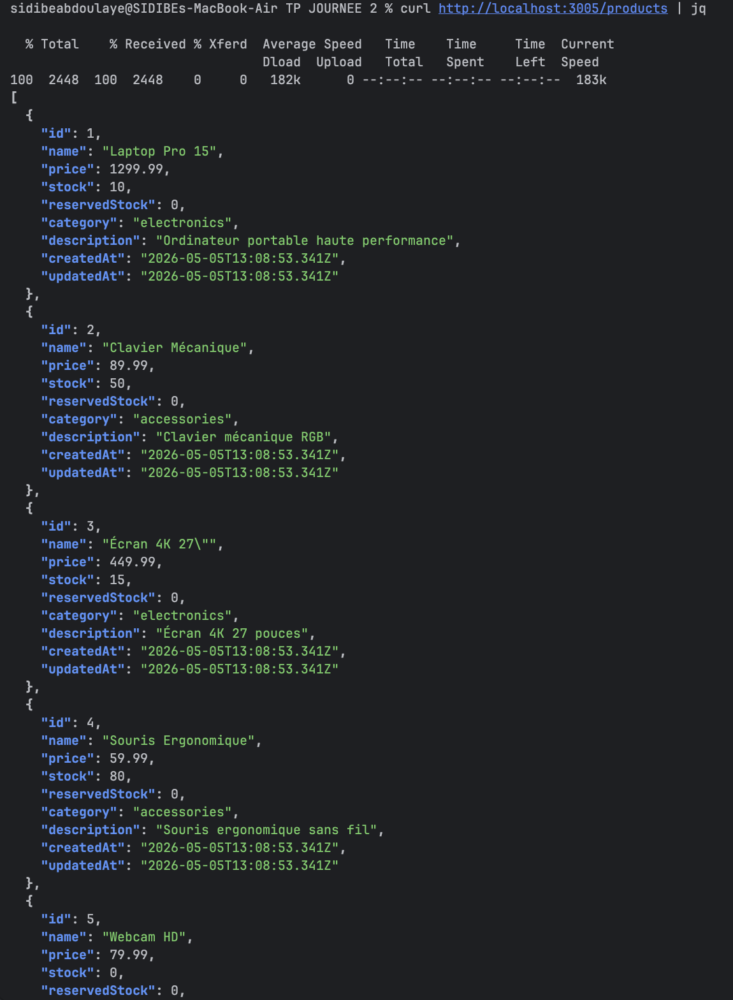
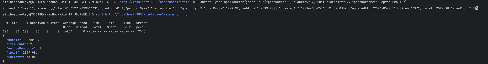
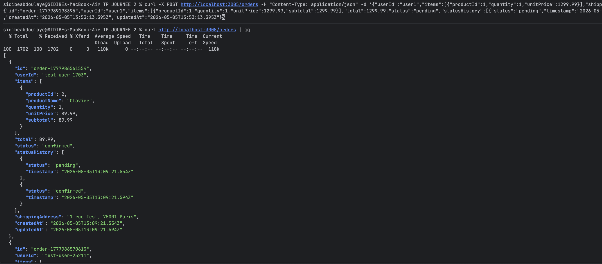

#  Spécifications des APIs

Ce document détaille les contrats de données et les comportements des microservices.

##  Point d'entrée : API Gateway
**URL de base** : `http://localhost:3005`

---

##  Service : Catalogue
**Port Interne** : `3001` | **Responsabilité** : Stock et Produits.

### `GET /products`
Liste exhaustive des produits.
- **Réponse 200** : `[{"id": 1, "name": "Laptop", "stock": 10, ...}]`



### `POST /products/:id/reserve`
Réserve `n` unités sans décrémenter le stock réel immédiatement.
- **Payload** : `{"quantity": 2}`
- **Réponse 200** : Produit mis à jour avec `reservedStock`.
- **Réponse 409** : `{"error": "Insufficient stock"}`

---

##  Service : Panier
**Port Interne** : `3002` | **Responsabilité** : Session d'achat.

### `GET /cart/:userId`
Récupère le panier.
- **Note** : Si l'utilisateur n'en a pas, un panier vide est initialisé.

### `POST /cart/:userId/items`
- **Payload** : 
  ```json
  {
    "productId": 1,
    "productName": "Souris",
    "quantity": 1,
    "unitPrice": 59.99
  }
  ```
- **Comportement** : Si le `productId` existe déjà, incrémente `quantity`.



---

##  Service : Commandes
**Port Interne** : `3003` | **Responsabilité** : Workflow et Paiement.

### `POST /orders`
Finalise une commande.
- **Workflow Interne** :
  1. Validation du payload.
  2. Calcul du total et des sous-totaux.
  3. Appel asynchrone au service **Notifications**.
- **Réponse 201** : Objet commande complet avec `id` (format: `order-TIMESTAMP`).



---

##  Service : Notifications
**Port Interne** : `3004` | **Responsabilité** : Communication client.

### `POST /notify`
Envoie une notification simulée.
- **Types valides** : `order_created`, `order_confirmed`, `order_shipped`, `order_delivered`, `order_cancelled`, `low_stock`.

---

## ️ Gestion des Erreurs Globales

Toutes les APIs utilisent un format d'erreur standardisé en cas d'échec (4xx ou 5xx) :

```json
{
  "error": "Nom de l'erreur (ex: NotFound)",
  "message": "Description détaillée du problème",
  "requestId": "req-123456789",
  "timestamp": "2026-05-05T09:40:00Z"
}
```

### Codes d'état communs

| Code | Signification | Cause possible |
| :--- | :--- | :--- |
| **400** | Bad Request | Payload JSON invalide ou champs obligatoires manquants. |
| **404** | Not Found | Ressource ou endpoint inexistant. |
| **429** | Too Many Requests | Limite de débit atteinte (Rate Limiting). |
| **500** | Internal Server Error | Erreur non gérée dans le code d'un service. |
| **503/504** | Service Unavailable | Un service dépendant est injoignable ou a expiré. |

---

##  Santé et Métriques (Standard)

### `GET /health`
Format de réponse unifié pour tous les services :
```json
{
  "status": "ok",
  "service": "commandes",
  "uptime": 120.5,
  "checks": {
    "memory": { "used_mb": 45, "threshold_mb": 400 },
    "dataStore": { "records": 12 }
  }
}
```


### `GET /metrics`
Exposition brute au format Prometheus :
```text
# HELP catalogue_requests_total Total HTTP requests
# TYPE catalogue_requests_total counter
catalogue_requests_total{method="GET",path="/products",status="200"} 42
```
