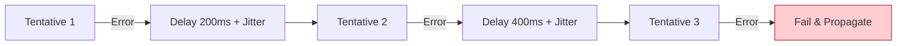
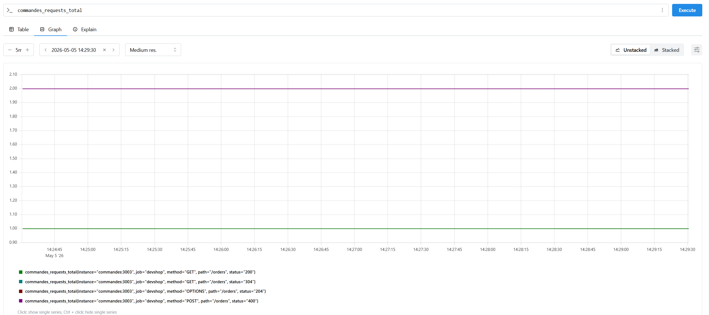
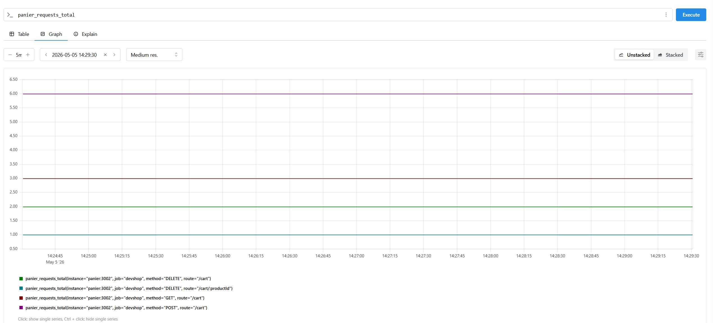
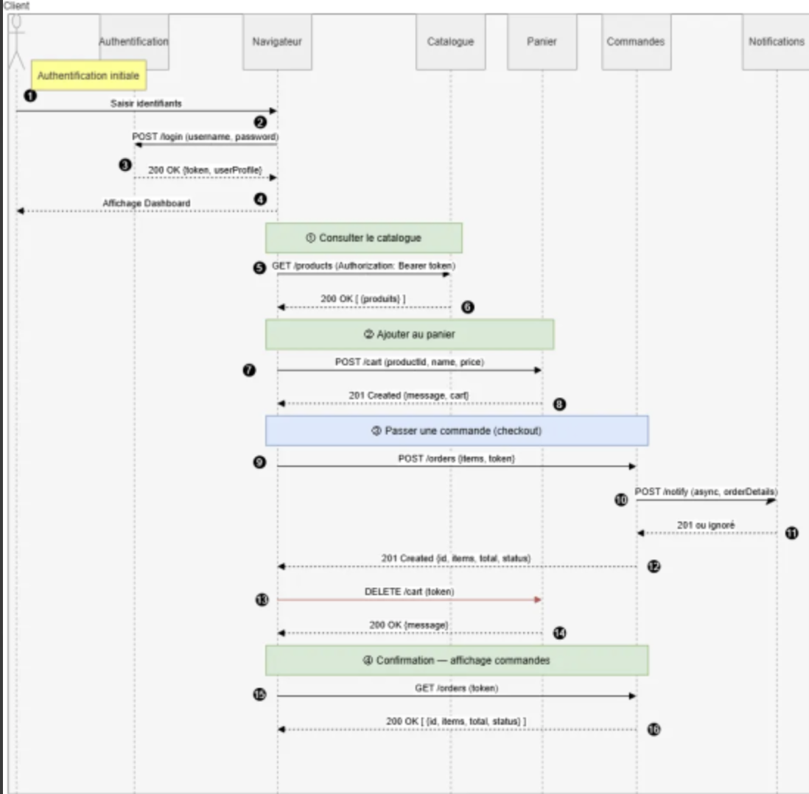

#  Guide d'Architecture Interne

## 1. Stratégie de Résilience (Communication Inter-services)
Nous utilisons le pattern **Retry with Jitter** pour tous les appels `Gateway -> Services` et `Orders -> Notifications`.

## 2. Observabilité "Zéro-Lib"
Chaque service possède un `metricsMiddleware` (`metrics.js`) qui intercepte l'événement `res.on('finish')`.
- **Latency tracking** : Les 200 dernières durées sont conservées en mémoire pour calculer une moyenne glissante.
- **Counter** : Incrémenté par tuple `{Method, Path, Status}`.

### Référentiel des Métriques

Tous les services exposent les métriques suivantes via `/metrics` :

| Nom de la Métrique | Type | Labels | Description |
| :--- | :--- | :--- | :--- |
| `http_requests_total` | Counter | `method`, `path`, `status` | Nombre total de requêtes HTTP traitées. |
| `http_request_duration_seconds_avg` | Gauge | Aucun | Temps de réponse moyen (moyenne glissante). |
| `service_uptime_seconds` | Counter | Aucun | Temps écoulé depuis le démarrage du service. |
| `service_memory_usage_bytes` | Gauge | Aucun | Consommation mémoire actuelle (RSS). |

**Métriques métier spécifiques :**
- `order_creation_total` : Nombre de commandes créées (Service Commandes).
- `cart_items_added_total` : Nombre d'articles ajoutés aux paniers (Service Panier).
- `product_stock_low` : Flag (0 ou 1) indiquant un stock critique (Service Catalogue).

### Exemples de métriques personnalisées
Nous avons implémenté des compteurs spécifiques pour suivre l'activité métier.

**Commandes :**

**Panier :**

## 3. Rate Limiting (Protection)
Implémenté dans la Gateway (`rate-limiter.js`).
- **Store** : Objet JS clé/valeur `{ "IP": {count, resetAt} }`.
- **Headers** : Injecte `X-RateLimit-Remaining` dans chaque réponse pour informer le client.
- **Sécurité** : Si la Gateway est redémarrée, les compteurs sont remis à zéro (stateless).

## 4. Gestion des Erreurs Globale
Chaque service possède deux middlewares finaux :
1. **404 Handler** : Capture toutes les routes non définies.
2. **500 Handler** : `try/catch` global qui formate les erreurs JS inattendues en JSON propre avec un `requestId`.

## 6. Flux de Requêtes (Diagramme de Séquence)

Ce diagramme illustre le parcours complet d'un utilisateur, de l'authentification jusqu'à la confirmation de commande, mettant en scène les interactions entre le Front-end et les différents microservices.

### Détail des étapes du flux :

#### 1. Authentification initiale
- **Connexion** : L'utilisateur saisit ses identifiants.
- **Validation** : Le navigateur envoie une requête `POST /login` au service d'Authentification.
- **Réponse** : Le service retourne un code `200 OK` avec un token de sécurité.
- **Résultat** : Affichage du Dashboard utilisateur.

#### 2. Consultation et Ajout au panier
- **Consulter le catalogue** : Le navigateur appelle le service Catalogue (`GET /products`) avec le token.
- **Ajouter au panier** : Envoi d'une requête `POST /cart` au service Panier avec les détails du produit. Le service répond par un `201 Created`.

#### 3. Passage de la commande (Checkout)
- **Création de commande** : Le navigateur envoie `POST /orders` au service Commandes.
- **Notification (Asynchrone)** : Le service Commandes contacte immédiatement le service Notifications (`POST /notify`) pour informer l'utilisateur.
- **Confirmation** : Le service Commandes confirme la création au navigateur (`201 Created`) avec l'ID de commande.
- **Nettoyage** : Le navigateur demande au service Panier de se vider via `DELETE /cart`.

#### 4. Confirmation et Affichage
- **Historique** : Appel final `GET /orders` pour récupérer la liste mise à jour des commandes.
- **Affichage final** : L'utilisateur voit sa confirmation de commande à l'écran.

### Concepts Clés de l'Architecture :
- **Sécurité (Bearer Token)** : Le token obtenu est réutilisé dans tous les appels suivants pour prouver l'identité.
- **Responsabilité Unique (Single Responsibility)** : Chaque service gère un domaine métier précis (Panier, Catalogue, Commandes).
- **Flux Asynchrone** : L'appel vers les notifications est non-bloquant pour ne pas ralentir le flux de commande principal.
