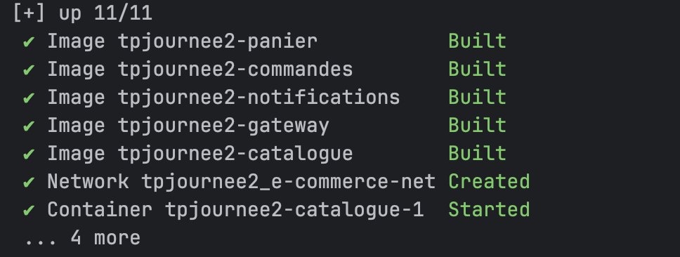
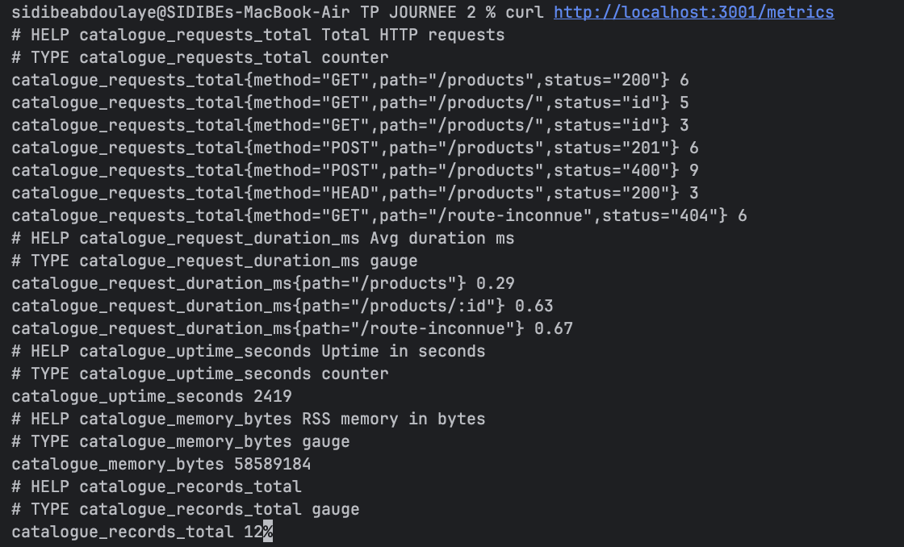
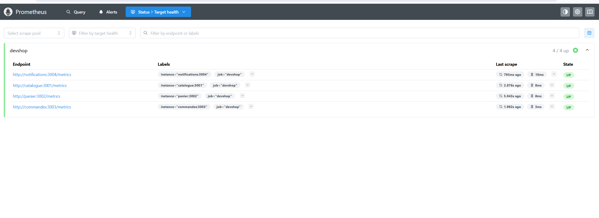

#  Plateforme Microservices E-Commerce Observable

[](#)
[](#)
[](#)

Ce projet est une implémentation de référence d'une architecture microservices hautement disponible, résiliente et observable, réalisée sans aucune librairie externe pour l'observabilité et la résilience.

---

##  Navigation Rapide
-  **[Spécifications API](API_SPEC.md)** : Détail des endpoints et contrats JSON.
-  **[Guide d'Architecture](ARCH_GUIDE.md)** : Fonctionnement interne (Retries, Rate Limit, Metrics).
-  **[Rapport Technique](rapport.md)** : Réponses aux questions théoriques (12-factor, K8s).
-  **[Dépannage](TROUBLESHOOTING.md)** : Solutions aux problèmes fréquents.

---

##  Architecture du Système
La plateforme est composée de 5 services isolés communiquant via un réseau virtuel Docker.

```text
                    [ Client / test.sh ]
                             |
                    ┌────────▼────────┐
                    │   API GATEWAY   │ :3005 (Host)
                    │ (Rate Limiting) │
                    └┬───────┬───────┬┘
                     │       │       │
      ┌──────────────▼─┐ ┌───▼────┐ ┌▼─────────────┐ ┌─────────────┐
      │   CATALOGUE    │ │ PANIER │ │  COMMANDES   │ │NOTIFICATIONS│
      │ (Inventory/Res)│ │ (Memory)│ │(Order Orch) │ │ (Email Sim) │
      └────────────────┘ └────────┘ └──────┬───────┘ └──────▲──────┘
                                           │                │
                                           └────────────────┘
```

---

##  Démarrage Rapide

### 1. Prérequis
- Docker Desktop (macOS/Windows) ou Docker Engine (Linux).
- Port 3005 disponible.

### 2. Lancement
```bash
# Construction et démarrage de la stack
docker compose up --build -d

# Vérification de l'état
docker compose ps
```



### 3. Validation Automatisée
Le projet inclut une suite de 46 tests d'intégration couvrant 100% des spécifications.
```bash
./test.sh
```


---

##  Choix Techniques & Résilience

| Mécanisme | Implémentation | Bénéfice |
| :--- | :--- | :--- |
| **Observabilité** | `/metrics` Prometheus Text & Logs JSON | Zero-overhead, standard industriel. |
| **Rate Limiting** | Fenêtre glissante (60s) par IP | Protection contre les attaques DoS. |
| **Résilience** | Exponential Backoff + Jitter | Tolérance aux pannes transitoires. |
| **Santé** | Health checks agrégés & individuels | Monitoring proactif (Liveness/Readiness). |
| **Shutdown** | Gestion propre du signal `SIGTERM` | Aucune perte de données en cours. |

---

##  Configuration (Variables d'Environnement)
Le système est configurable via un fichier `.env`. Voici les variables principales :

| Variable | Description | Valeur par défaut |
| :--- | :--- | :--- |
| `NODE_ENV` | Mode d'exécution (development/production) | `development` |
| `GATEWAY_PORT` | Port exposé par la Gateway | `3005` |
| `CATALOGUE_URL` | URL interne pour le service Catalogue | `http://catalogue:3001` |
| `PANIER_URL` | URL interne pour le service Panier | `http://panier:3002` |
| `COMMANDES_URL` | URL interne pour le service Commandes | `http://commandes:3003` |
| `NOTIFICATIONS_URL` | URL interne pour le service Notifications | `http://notifications:3004` |

---

##  Scénario d'Utilisation Typique

Pour tester manuellement le flux complet, vous pouvez suivre ces étapes avec `curl` :

1. **Lister les produits** :
   ```bash
   curl http://localhost:3005/products
   ```
2. **Ajouter au panier** :
   ```bash
   curl -X POST http://localhost:3005/cart/user1/items \
     -H "Content-Type: application/json" \
     -d '{"productId": 1, "productName": "Laptop", "quantity": 1, "unitPrice": 999.99}'
   ```
3. **Passer la commande** :
   ```bash
   curl -X POST http://localhost:3005/orders \
     -H "Content-Type: application/json" \
     -d '{"userId": "user1", "items": [{"productId": 1, "quantity": 1}], "total": 999.99}'
   ```

---

##  Monitoring & Logs

### Consulter les Métriques
Chaque service expose des métriques en temps réel.
```bash
curl http://localhost:3001/metrics # Catalogue
curl http://localhost:3003/metrics # Commandes
```





### Dashboard Grafana
Visualisation globale de l'état du système.


### Visualiser les Logs
Les logs sont structurés en JSON pour faciliter l'indexation.
```bash
docker compose logs -f gateway
```

---
