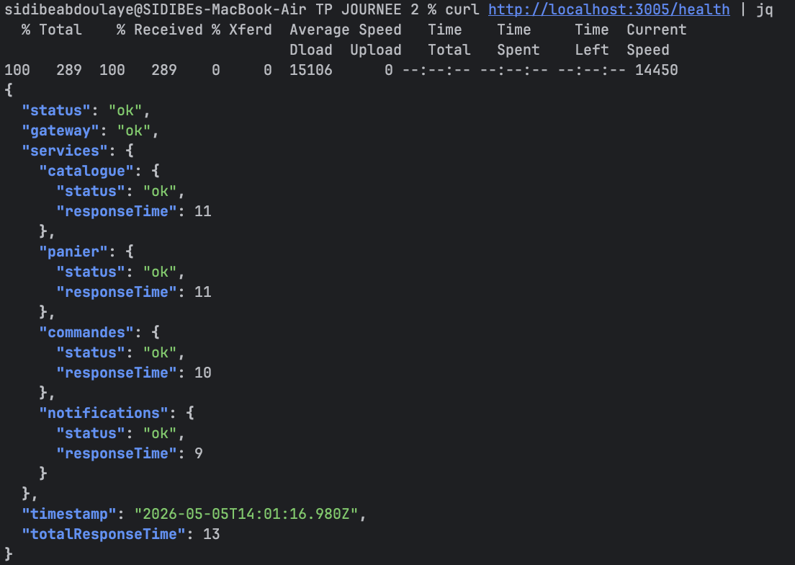
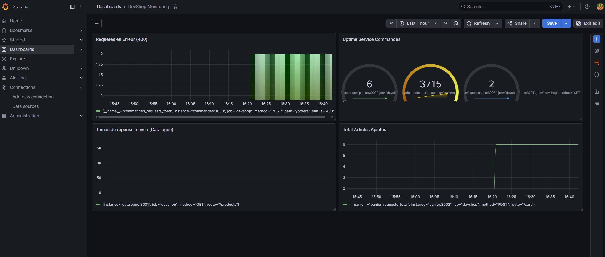
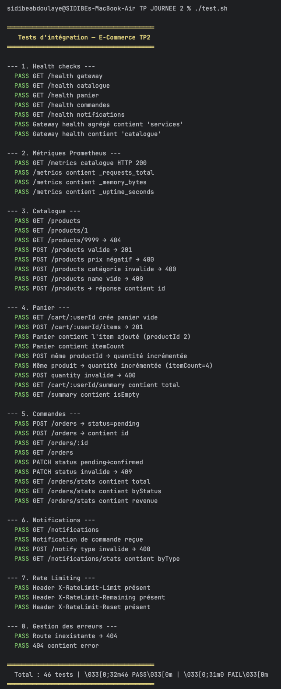

# 📄 Rapport Technique — TP Plateforme E-Commerce Observable

## 📑 Sommaire
1. [Méthodologie 12-Factor App](#1-méthodologie-12-factor-app)
2. [Health Checks & Cycle de vie Kubernetes](#2-health-checks--cycle-de-vie-kubernetes)
3. [Gestion des Logs en environnement Conteneurisé](#3-gestion-des-logs-en-environnement-conteneurisé)
4. [Problématique de la Mise à l'Échelle (Rate Limiting)](#4-problématique-de-la-mise-à-léchelle-rate-limiting)
5. [Garantie de Délivrance et Patterns de Messagerie](#5-garantie-de-délivrance-et-patterns-de-messagerie)
6. [Mise en œuvre de l'Observabilité](#6-mise-en-œuvre-de-lobservabilité)
7. [Conclusion](#7-conclusion)

---

## 1. Méthodologie 12-Factor App
L'architecture a été conçue pour respecter les principes du manifeste **12-Factor**, garantissant portabilité et scalabilité.

| Facteur | Statut | Implémentation |
| :--- | :--- | :--- |
| **1. Codebase** | ✅ | Un seul dépôt Git pour tous les microservices. |
| **2. Dependencies** | ✅ | Déclaration explicite dans `package.json`, isolation via Docker. |
| **3. Config** | ✅ | Configuration par variables d'environnement (`.env`). |
| **4. Backing Services** | ✅ | Services traités comme ressources attachées (URLs configurables). |
| **5. Build, Release, Run** | ✅ | Séparation stricte via les étapes de build Docker. |
| **6. Processes** | ✅ | Services stateless, exécution comme processus isolés. |
| **7. Port Binding** | ✅ | Chaque service expose son propre port via HTTP. |
| **8. Concurrency** | ✅ | Scaling horizontal possible via Docker Compose réplicas. |
| **9. Disposability** | ✅ | Gestion du signal `SIGTERM` pour un arrêt propre. |
| **10. Dev/Prod Parity** | ✅ | Environnements identiques grâce aux conteneurs. |
| **11. Logs** | ✅ | Flux d'événements sur `stdout` au format JSON. |
| **12. Admin Processes** | ✅ | Tâches d'administration via endpoints dédiés (ex: purge). |

---

## 2. Health Checks & Cycle de vie Kubernetes
Dans une orchestration Kubernetes, la distinction entre les sondes est cruciale :

- **LivenessProbe** : Détermine si le conteneur a besoin d'être redémarré (ex: deadlock).
- **ReadinessProbe** : Détermine si le conteneur est prêt à accepter du trafic. S'il échoue, il est retiré du Load Balancer.

**Observation sur notre implémentation :**
Notre endpoint `/health` actuel est un "Fat Healthcheck" qui vérifie à la fois la mémoire et la disponibilité des données. Pour K8s, nous devrions le scinder :
- `/health/live` : Réponse 200 immédiate (le processus tourne).
- `/health/ready` : Vérification des dépendances (connexion aux autres services/DB).

---

## 3. Gestion des Logs en environnement Conteneurisé
L'écriture des logs sur `stdout` est une recommandation forte de la "Cloud Native Computing Foundation" (CNCF).

**Pourquoi stdout vs fichiers ?**
1. **Éphémérité** : Les fichiers dans un conteneur disparaissent à sa suppression.
2. **Standardisation** : Permet au moteur de conteneur (Docker/K8s) de gérer la rotation et l'acheminement vers des collecteurs (Splunk, ELK, Loki) sans logique applicative complexe.

**Risque identifié** : Lors d'un `docker compose down`, les logs non collectés par un agent externe sont perdus définitivement car le cycle de vie du log est lié à celui du conteneur.

---

## 4. Problématique de la Mise à l'Échelle (Rate Limiting)
**Défi** : Notre Rate Limiter actuel stocke les compteurs en mémoire locale. 
**Scénario** : Avec 3 réplicas de la Gateway, une IP limitée à 100 req/min pourrait en réalité effectuer 300 requêtes (100 sur chaque instance).

**Solution préconisée** : L'utilisation d'un **store distribué (Redis)**. 
- Les instances de Gateway partagent un état commun.
- Utilisation de scripts Lua ou de commandes atomiques (`INCR`) pour éviter les "race conditions".

---

## 5. Garantie de Délivrance et Patterns de Messagerie
Pour garantir l'envoi d'une notification (At-Least-Once delivery), deux approches majeures sont envisageables :

1. **Message Broker (Asynchronisme)** : Utiliser RabbitMQ ou Kafka. Le service Commandes publie un message. Si le service Notifications est indisponible, le message attend dans la file d'attente.
2. **Transactional Outbox Pattern** : Enregistrer la notification en base de données dans la même transaction que la commande. Un worker séparé tente l'envoi tant qu'il ne reçoit pas un ACK du service de notification.

---

## 6. Mise en œuvre de l'Observabilité
L'un des points forts de ce TP est l'implémentation de métriques "Zero-Dependency".

### Flux Nominal et Interactions
Le diagramme suivant détaille le cycle de vie d'une requête utilisateur à travers les différents services :

- **Prometheus** : Collecte les métriques exposées sur `/metrics`.
- **Grafana** : Permet la visualisation de la santé globale.

Le succès des tests automatisés confirme la robustesse de l'implémentation :

---

## 7. Conclusion
Ce projet démontre qu'il est possible de construire une architecture microservices résiliente et observable en utilisant les standards du web (HTTP, JSON, Prometheus Text Format) sans dépendre de librairies lourdes. Le respect des **12 Factors** et la mise en place de stratégies de **Retry** et de **Rate Limiting** assurent une base solide pour une mise en production réelle.
